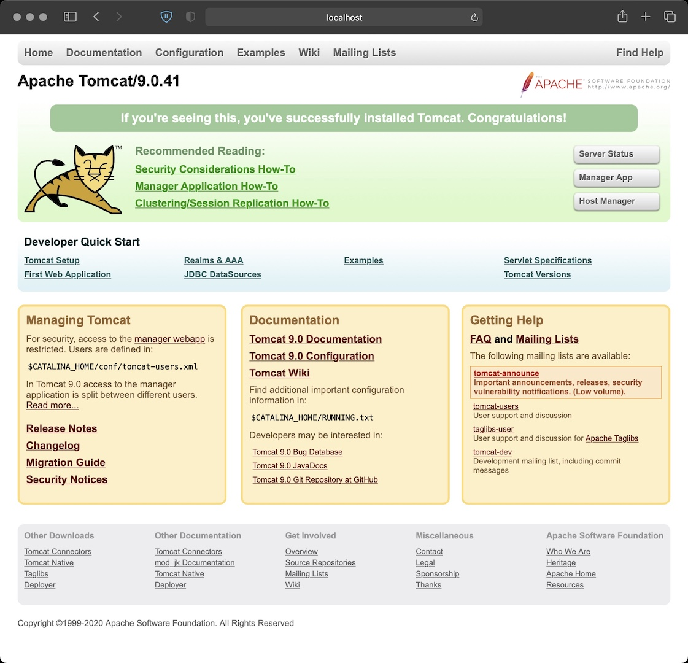

# CentOS_Tomcat_OpenJDK
A container image with Centos 8, OpenJDK 11.0.9, OpenSSL 1.1.1i, Tomcat 9.0.41 and Tomcat Native Library 1.2.25

#### Get the image from dockerhub
Get this container with:
docker pull techcasita/centos_tomcat_openjdk


#### Or build, Tag, and Push the image to dockerhub

docker build -t centos_tomcat_openjdk .
docker tag centos_tomcat_openjdk:latest techcasita/centos_tomcat_openjdk
docker login
  Username: wolfpaulus
docker push techcasita/centos_tomcat_openjdk:latest

### Run the container

docker run --rm -it --name tc -p 8080:8080 centos_tomcat_openjdk:latest
Open a web browser at http://localhost:8080/
docker exec -it tc /bin/bash

E.g.:
```
docker exec -it tc /bin/bash
[root@f6d3f3058f17 tomcat]# java -version
openjdk version "11.0.9.1" 2020-11-04
OpenJDK Runtime Environment AdoptOpenJDK (build 11.0.9.1+1)
OpenJDK 64-Bit Server VM AdoptOpenJDK (build 11.0.9.1+1, mixed mode)
```



